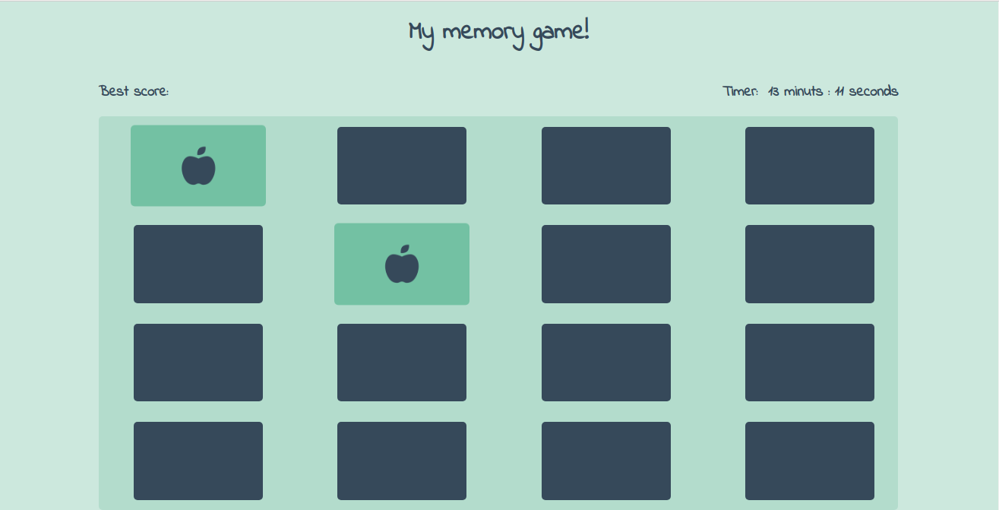
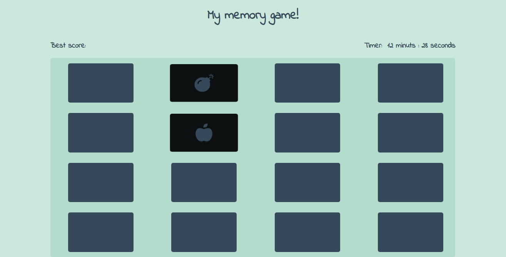

# My memory game!

Project 2 udacity frontend - nanodegree.  
It was to learn more about some concepts in frontend world.

# Technology
* HTML
* CSS
* JavaScript

# Try it now

You can try this project on line on this [link](https://memory-game-4a0c9.firebaseapp.com/).  
If the link does not work, please, copy this link `https://memory-game-4a0c9.firebaseapp.com/` and paste in your default brawser.

# Author
* Elias Reis (eliasreis54@gmail.com)

# Images

 

 
